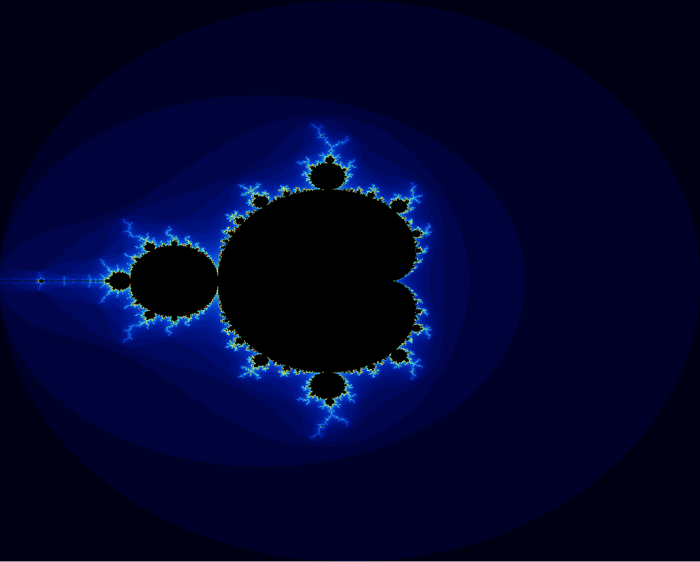
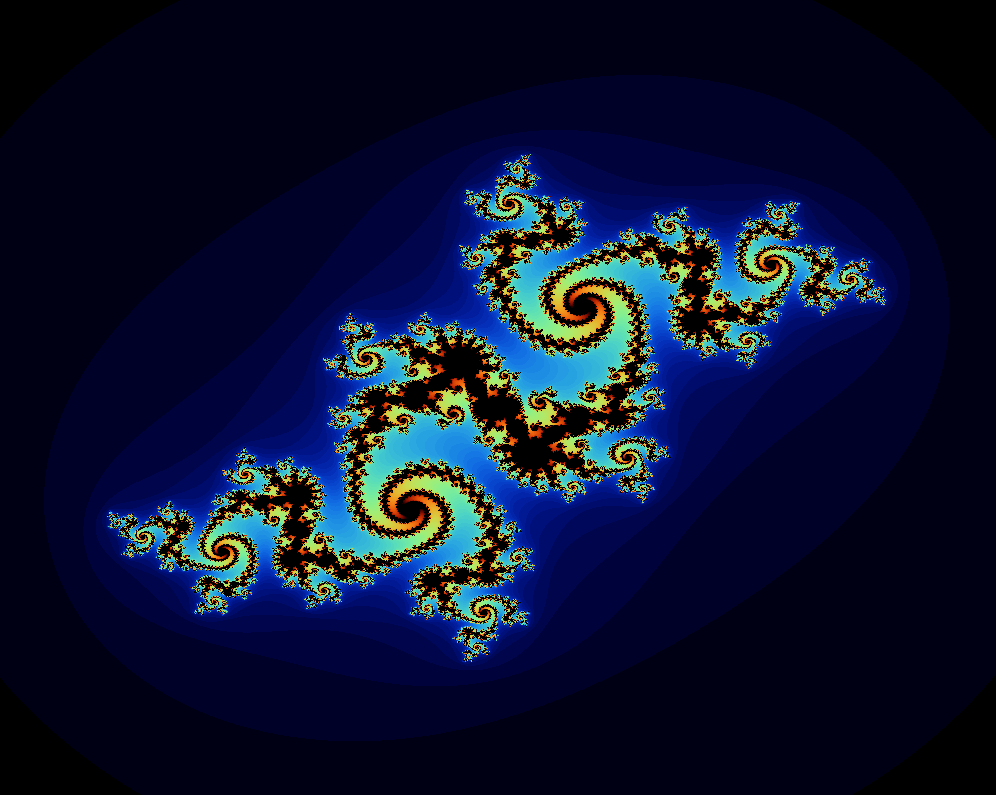
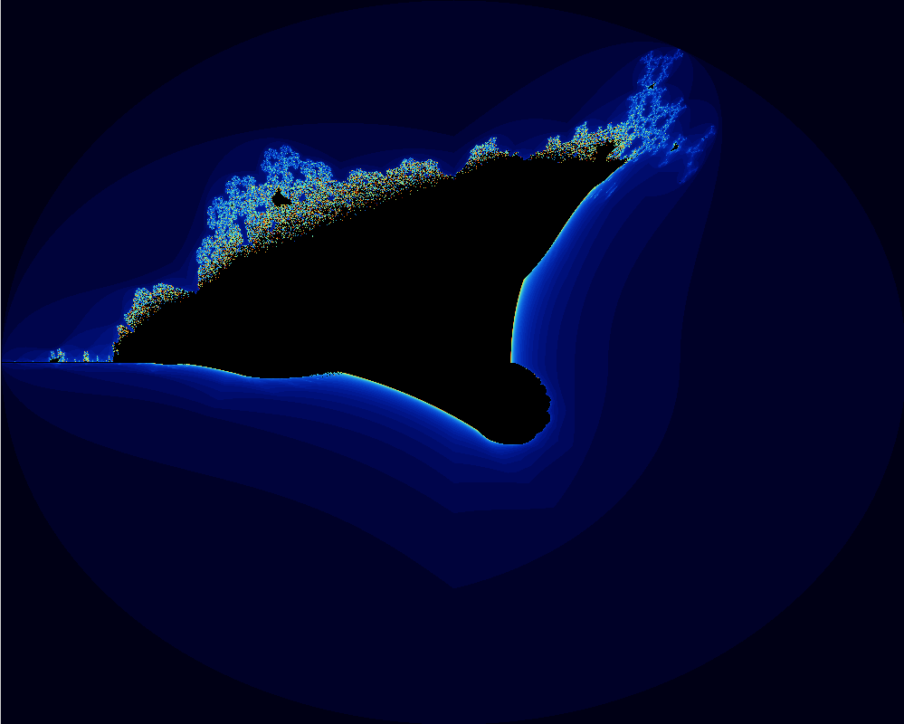
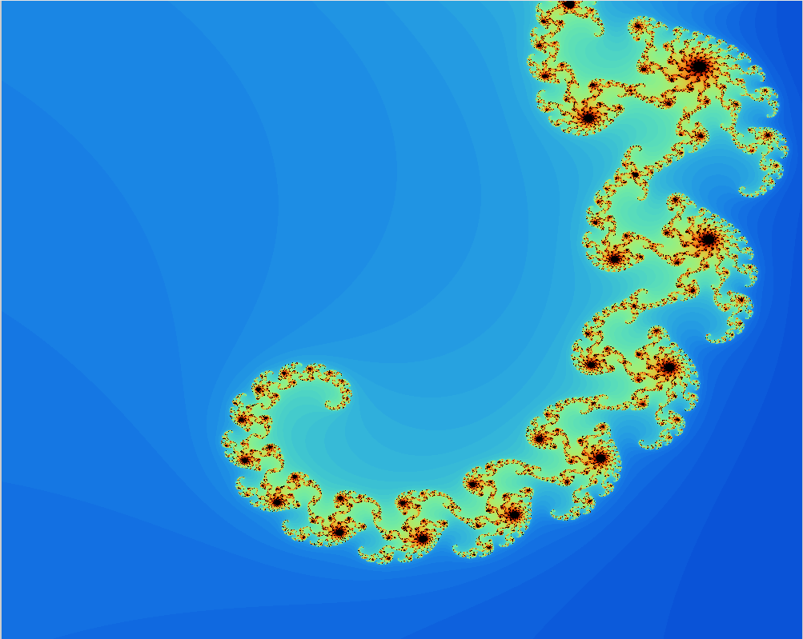

# 🌌 Fract-ol - Beautiful Fractal Explorer



A powerful and interactive fractal visualization program built in C using the MiniLibX graphics library. Explore the mesmerizing world of mathematical fractals with real-time zoom, pan, and color manipulation capabilities.

## 📋 Table of Contents

- [Features](#-features)
- [Fractals Included](#-fractals-included)
- [Installation](#-installation)
- [Usage](#-usage)
- [Controls](#-controls)
- [Gallery](#-gallery)
- [Technical Details](#-technical-details)
- [Project Structure](#-project-structure)

## ✨ Features

- **Three Fractal Types**: Mandelbrot Set, Julia Set, and Burning Ship
- **Real-time Rendering**: Smooth and optimized fractal generation
- **Interactive Controls**: 
  - Zoom in/out with mouse scroll or keyboard
  - Pan with arrow keys
  - Dynamic color shifting
  - Julia set parameter manipulation
- **High Performance**: Optimized with compiler flags for maximum speed
- **Cross-platform**: Works on Linux systems with X11

## 🎨 Fractals Included

### 1. Mandelbrot Set
The classic fractal that defined the field of fractal geometry. Famous for its infinitely complex boundary and self-similar patterns.


### 2. Julia Set
A family of fractals related to the Mandelbrot set, with customizable parameters that create stunning variations.



### 3. Burning Ship
A variation of the Mandelbrot set that creates ship-like formations with intricate detail.



## 🚀 Installation

### Prerequisites
- GCC compiler
- X11 development libraries
- Make

### Build Instructions

1. **Clone the repository**:
   ```bash
   git clone [repository-url]
   cd fractol
   ```

2. **Compile the project**:
   ```bash
   make
   ```

3. **Clean build files** (optional):
   ```bash
   make clean    # Remove object files
   make fclean   # Remove all generated files
   make re       # Clean and rebuild
   ```

## 🎮 Usage

The program accepts different fractal types as command-line arguments:

### Mandelbrot Set
```bash
./fractol mandelbrot
```

### Julia Set (with custom parameters)
```bash
./fractol julia <real_part> <imaginary_part>
```

**Examples:**
```bash
./fractol julia -0.7 0.27015    # Classic Julia set
./fractol julia -0.8 0.156      # Another beautiful variation
./fractol julia 0.285 0.01      # Delicate spiral patterns
```

### Burning Ship
```bash
./fractol burning_ship
```

## 🎯 Controls

### General Navigation
| Key | Action |
|-----|--------|
| `↑ ↓ ← →` | Pan the view |
| `Mouse Scroll` | Zoom in/out at cursor position |
| `C` | Shift color palette |
| `ESC` | Exit program |

### Julia Set Specific Controls
| Key | Action |
|-----|--------|
| `A` | Decrease real parameter |
| `D` | Increase real parameter |
| `W` | Increase imaginary parameter |
| `S` | Decrease imaginary parameter |

## 🖼️ Gallery

### Zoomed Mandelbrot Set
Discover the infinite detail hidden within the Mandelbrot set:



*The beauty of fractals lies in their infinite complexity - no matter how far you zoom, there's always more detail to discover.*

## 🔧 Technical Details

### Performance Optimizations
- **Compiler Flags**: `-Ofast -march=native -flto -funroll-loops -ffast-math`
- **Maximum Iterations**: 100 (configurable)
- **Resolution**: 1000x800 pixels
- **Efficient Color Mapping**: Fast color interpolation for smooth gradients

### Mathematical Implementation
- Uses complex number arithmetic for fractal calculations
- Escape-time algorithm for determining point membership
- Double precision floating-point for accuracy during zoom operations

### Graphics System
- Built on MiniLibX for efficient pixel manipulation
- Real-time image buffer updates
- Event-driven architecture for responsive controls

## 📁 Project Structure

```
fractol/
├── main.c                  # Program entry point
├── Makefile               # Build configuration
├── include/
│   └── fractol.h         # Header file with definitions
├── fractals/
│   ├── mandelbrot.c      # Mandelbrot set implementation
│   ├── julia.c           # Julia set implementation
│   ├── burning_ship.c    # Burning ship implementation
│   └── drawer.c          # Rendering functions
├── tools/
│   ├── hooks.c           # Event handling
│   ├── math.c            # Mathematical utilities
│   ├── render_tools.c    # Rendering utilities
│   ├── utils.c           # General utilities
│   └── window.c          # Window management
├── printf/               # Custom printf implementation
├── minilibx-linux/       # Graphics library
└── images/               # Example fractal images
```

*"Fractals are the poetry of mathematics, where infinite complexity emerges from simple rules."*
